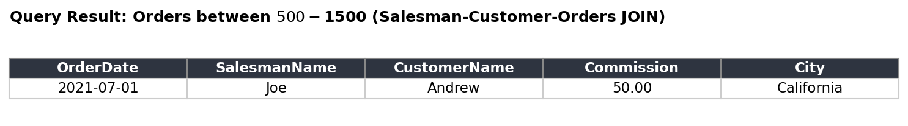
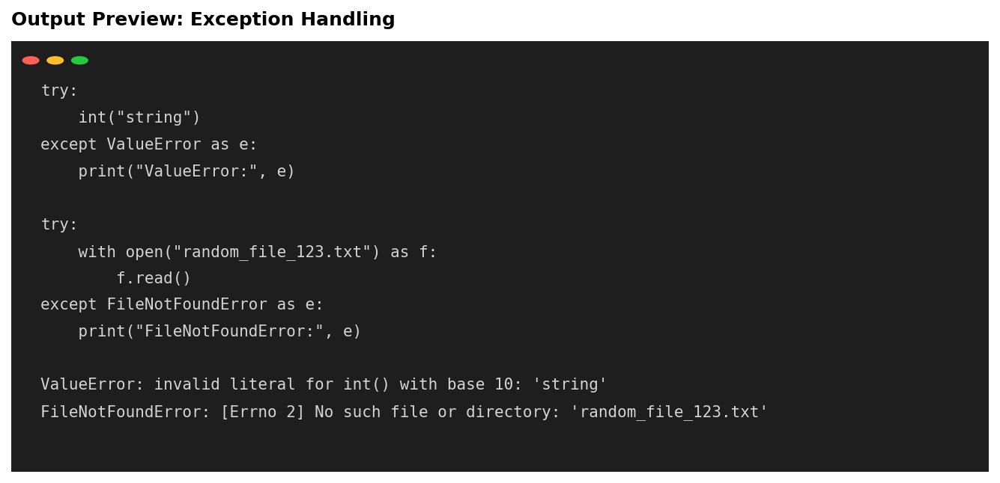
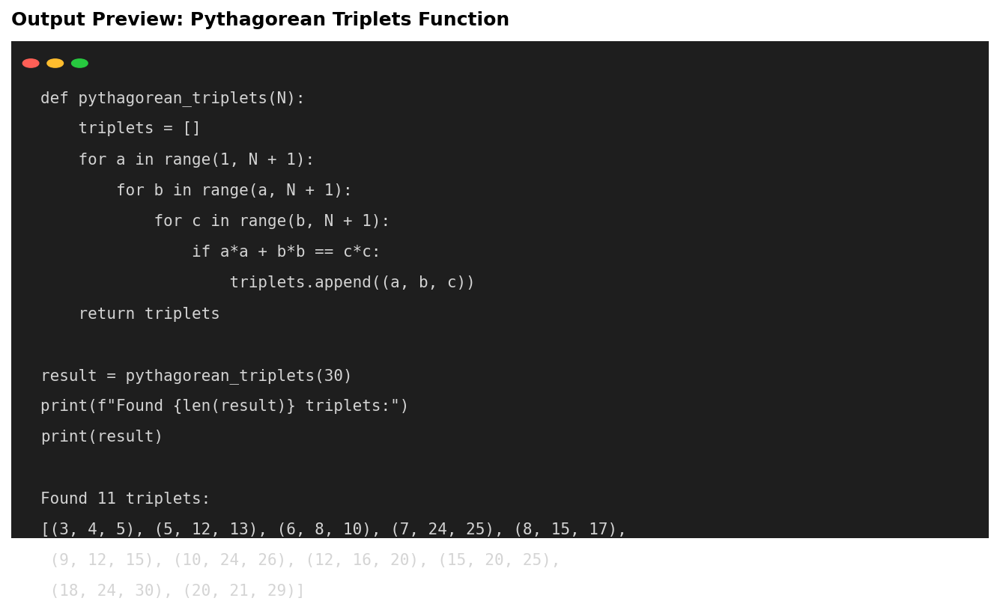

# Python Programming & Data Structures

## Overview
A collection of Python fundamentals demonstrating core language concepts through practical, self-contained examples — from basic expressions to modular function design.

## Tools Used
- Python 3
- NumPy

## What's Inside
The notebook (`python_fundamentals.ipynb`) covers:

- **Variables & Expressions** — compound interest calculation
- **String Operations** — formatting, escape characters, slicing
- **Lambda Functions** — inline function definitions
- **Conditional Expressions** — ternary-style logic
- **NumPy** — array creation and statistical operations (mean, standard deviation)
- **Exception Handling** — `NameError`, `ValueError`, `FileNotFoundError` with try/except
- **Data Types** — strings, type checking, string conversion
- **Data Structures** — dictionaries, tuples (and immutability), sets (de-duplication)
- **Modular Function Design** — a function to find all Pythagorean triplets up to a given limit

## Key Skills Demonstrated
- Writing clean, well-documented Python code
- Working with core data structures (lists, tuples, dictionaries, sets)
- Proper exception handling with try/except blocks
- NumPy for numerical and statistical operations
- Designing reusable functions with docstrings

### Output Preview

## How to Run
1. Clone this repository
2. Install NumPy: `pip install numpy`
3. Open `python_fundamentals.ipynb` in Jupyter Notebook or Google Colab and run all cells
